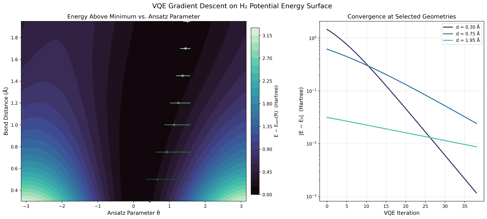
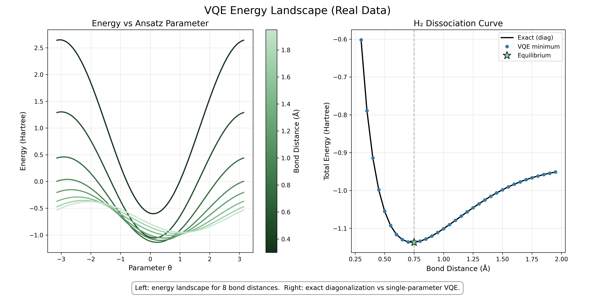

# Quantum-Chemistry-Eigensolver
###### A from-scratch variational quantum eigensolver for H₂ dissociation, built on Qiskit 2.0 without Qiskit Nature.

<p align="center">
  <a href="https://github.com/IsolatedSingularity/Quantum-Chemistry-Eigensolver/actions/workflows/ci.yml"></a>
  <a href="https://www.python.org/downloads/"></a>
  <a href="LICENSE"></a>
  <a href="#installation"></a>
</p>


<p align="center">
  
</p>

## Objective

This repository implements a from-scratch **Variational Quantum Eigensolver (VQE)** for the H₂ molecule on Qiskit 2.0. The electronic Hamiltonian is expressed in second quantization using one-electron ($h_{pq}$) and two-electron ($h_{pqrs}$) integrals, then mapped to qubit operators via the Jordan-Wigner transformation.

**Goal:** Compute the H₂ dissociation curve at 34 bond distances using a from-scratch VQE pipeline, and validate against exact diagonalization.

Design decisions:
- **No Qiskit Nature dependency.** Every component is built from scratch: Pauli algebra engine (symplectic bit encoding, vectorized phase computation), Jordan-Wigner mapper, Hartree-Fock solver, QWC measurement grouping.
- **Analytic gradients** via the parameter-shift rule instead of finite differences.
- **Typed Python** with mypy in CI, ruff for linting, and 70 pytest tests across 5 modules.

<p align="center">
  
</p>

## Code Functionality

### 1. Molecule and Integrals
Pre-computed spin orbital integrals for H₂ at 34 bond distances are loaded from `.npz` files. Each contains one-electron ($h_{pq}$) and two-electron ($h_{pqrs}$) integrals plus nuclear repulsion energy.

```python
def load_h2_spin_orbital_integral(data_path, filename):
    """Load a single H2 integral file (sequential npy streams)."""
    file = os.path.join(data_path, filename)
    with open(file, "rb") as f:
        distance = np.load(f, allow_pickle=False)
        one_body = np.load(f, allow_pickle=False)
        two_body = np.load(f, allow_pickle=False)
        nuc_eneg = np.load(f, allow_pickle=False)
    return distance, one_body, two_body, nuc_eneg
```

### 2. Hamiltonian Construction
The Jordan-Wigner transformation converts each fermionic operator $a_p^\dagger$ into Pauli X, Y operators at position $p$ with a Z-string on preceding qubits. One-body and two-body terms are transformed and combined into a single `Operator` representing the qubit Hamiltonian.

```python
def build_qubit_hamiltonian(one_body, two_body, creation_ops, annihilation_ops):
    """Build qubit Hamiltonian from fermionic integrals using JW mapping."""
    h1 = build_one_body_qubit_hamiltonian(one_body, creation_ops, annihilation_ops)
    h2 = build_two_body_qubit_hamiltonian(two_body, creation_ops, annihilation_ops)
    return (h1 + h2).combine().apply_threshold().sort()
```

### 3. VQE Optimization
A particle-number-preserving ansatz starts from the Hartree-Fock state |0101⟩ and applies a CNOT staircase, reducing the double excitation to a single Ry rotation. The resulting state $\cos(\theta/2)|0101\rangle + \sin(\theta/2)|1010\rangle$ always contains exactly 2 electrons. Pauli terms are grouped into qubitwise-commuting (QWC) sets to reduce measurement circuits.

```python
def h2_ansatz_circuit():
    """Build a particle-number-preserving H2 ansatz with 1 parameter."""
    varform = QuantumCircuit(4)
    theta = Parameter('theta')
    varform.x([1, 3])           # Prepare |0101⟩
    varform.cx(1, 0)            # CNOT staircase
    varform.cx(2, 1)
    varform.cx(3, 2)
    varform.ry(theta, 3)        # Parametric rotation
    varform.cx(3, 2)            # Reverse staircase
    varform.cx(2, 1)
    varform.cx(1, 0)
    return varform
```

## Installation

```bash
# Clone and install
git clone https://github.com/IsolatedSingularity/Quantum-Chemistry-Eigensolver.git
cd Quantum-Chemistry-Eigensolver
pip install -e ".[dev]"

# Run the test suite
pytest
```

### CLI Entry Points

| Command | Description |
|---|---|
| `qce-dissociation` | Run VQE across all H₂ bond distances and plot the dissociation curve |
| `qce-visualize` | Generate molecular orbital and VQE energy visualizations |

```bash
# Example: compute dissociation curve and save the plot
qce-dissociation --shots 10000 -o dissociation.png

# Generate all visualizations
qce-visualize --which all
```

To add a new molecule, generate spin-orbital integrals with PySCF (see `usage/`) and pass the data directory to `qce-dissociation --data-path`.

## Project Structure

| Directory | Purpose |
|---|---|
| `quantum_chemistry/` | Core library: Pauli algebra, Jordan-Wigner mapping, estimation, VQE |
| `quantum_chemistry/molecule/` | Molecular integrals, Hartree-Fock solver (RHF + UHF), linear algebra |
| `tests/` | 70 pytest tests (unit, integration, end-to-end VQE) |
| `examples/` | Step-by-step tutorials for mapping and estimation |
| `visualization/` | Matplotlib visualizations and animations |
| `h2_data/` | Pre-computed H₂ spin-orbital integrals (34 bond distances) |

<details>
<summary><h2>Theoretical Background</h2></summary>

### Second Quantization and the Jordan-Wigner Mapping

The electronic Hamiltonian in second quantization is

$$\hat{H} = \sum_{p,q} h_{pq}\, a_p^\dagger a_q \;+\; \frac{1}{2}\sum_{p,q,r,s} h_{pqrs}\, a_p^\dagger a_q^\dagger a_r a_s \;+\; E_{\text{nuc}}$$

where $h_{pq}$ and $h_{pqrs}$ are one- and two-electron integrals computed in the STO-3G basis and $E_{\text{nuc}}$ is the nuclear repulsion energy. For H₂, 2 spatial orbitals $\times$ 2 spins = 4 spin-orbitals, each mapped to one qubit via the Jordan-Wigner transformation:

$$a_j^{\dagger} \rightarrow \tfrac12\bigl(X_j - iY_j\bigr) \prod_{k<j} Z_k, \qquad a_j \rightarrow \tfrac12\bigl(X_j + iY_j\bigr) \prod_{k<j} Z_k$$

The Z-string enforces fermionic antisymmetry. After substitution and simplification, the 4-qubit Hamiltonian reduces to a weighted sum of Pauli strings that can be measured on a quantum device.

### Variational Quantum Eigensolver

VQE exploits the variational principle: for any trial state $|\psi(\theta)\rangle$, the expectation value is an upper bound on the true ground state energy,

$$E(\theta) = \langle\psi(\theta)|\,\hat{H}\,|\psi(\theta)\rangle \;\geq\; E_0$$

The classical optimizer tunes $\theta$ to minimize $E(\theta)$. Gradients are computed with the parameter-shift rule,

$$\frac{\partial E}{\partial \theta} = \frac{1}{2}\Bigl[E\!\bigl(\theta + \tfrac{\pi}{2}\bigr) - E\!\bigl(\theta - \tfrac{\pi}{2}\bigr)\Bigr]$$

which requires only two additional circuit evaluations per parameter and is exact for gates of the form $e^{-i\theta G/2}$.

### Ansatz Design

The ansatz prepares the Hartree-Fock reference $|0101\rangle$ (2 electrons in the lowest spin-orbitals), then applies a CNOT staircase that compiles the double excitation $a_2^\dagger a_3^\dagger a_1 a_0$ into a single $R_y(\theta)$ rotation. The resulting state,

$$|\psi(\theta)\rangle = \cos(\theta/2)\,|0101\rangle + \sin(\theta/2)\,|1010\rangle$$

spans the two-dimensional subspace of particle-number-conserving configurations and is exact for H₂ in a minimal basis.

### Measurement Reduction

Each Pauli string in the Hamiltonian must be measured independently unless it commutes qubitwise with other strings. Two Pauli operators $P_a$ and $P_b$ are qubitwise commuting (QWC) when $[\sigma_i^{(a)},\, \sigma_i^{(b)}] = 0$ for every qubit $i$. Grouping QWC-compatible terms lets multiple expectation values share a single measurement circuit, reducing the total number of circuits from one per Pauli string to one per QWC group.

</details>

## Results

Ground state energy at equilibrium: **-1.137 Ha** (within $10^{-6}$ Ha of exact diagonalization). 70 pytest tests across 5 modules, 87% line coverage, type-checked with mypy.

Bonding and antibonding molecular orbitals of H₂, computed from one-electron integrals in the STO-3G basis.


Bond-length sweep from 0.3 to 1.95 Å showing the H₂ wavefunction transitioning from a compact bonding state to separated atoms.


VQE energy landscape across 8 sampled bond distances (left) and the full dissociation curve compared against exact diagonalization (right).

<p align="center">
  
</p>

VQE potential energy surface showing E(theta, R) - E_min(R) across all 34 bond distances. Gradient-descent trajectories (parameter-shift rule) are shown at 8 sampled geometries: paths are short near equilibrium where the well is deep and converge slowly toward dissociation where coupling weakens. Right panel: energy error on a log scale at three geometries (compressed, equilibrium, stretched).

<p align="center">
  
</p>

## Next Steps

- [ ] Implement more sophisticated ansatz circuits, such as the Unitary Coupled Cluster (UCC) ansatz for better accuracy.
- [ ] Extend the implementation to handle larger molecules like LiH, BeH₂, or H₂O.
- [ ] Incorporate noise models to simulate realistic quantum hardware performance.
- [ ] Implement quantum subspace expansion techniques to improve accuracy of excited state calculations.
- [ ] Add support for calculating molecular properties beyond the ground state energy (dipole moments, forces, etc.).

> [!NOTE]
> This project targets H₂ as a proof of concept. The single-parameter ansatz may not capture all relevant physics for larger molecules, and classical simulation does not account for hardware noise or decoherence.

## Acknowledgments

Built by [Jeffrey Morais](https://ichor.pages.dev/), Quantum Software Lead at BTQ Technologies.

Inspired by workshop notebooks from [Maxime Dion](https://www.usherbrooke.ca/iq/en/news-events/news/details/54588) at the [Institut Quantique](https://www.usherbrooke.ca/iq/).

